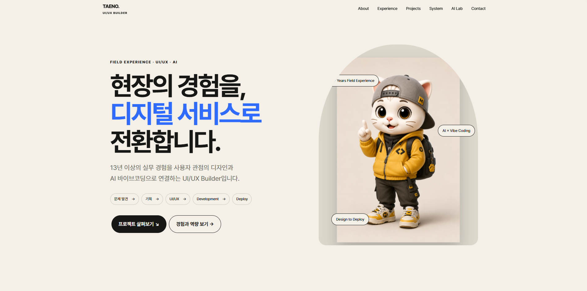
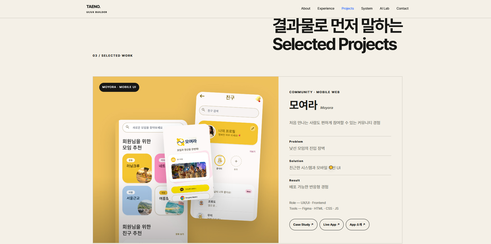
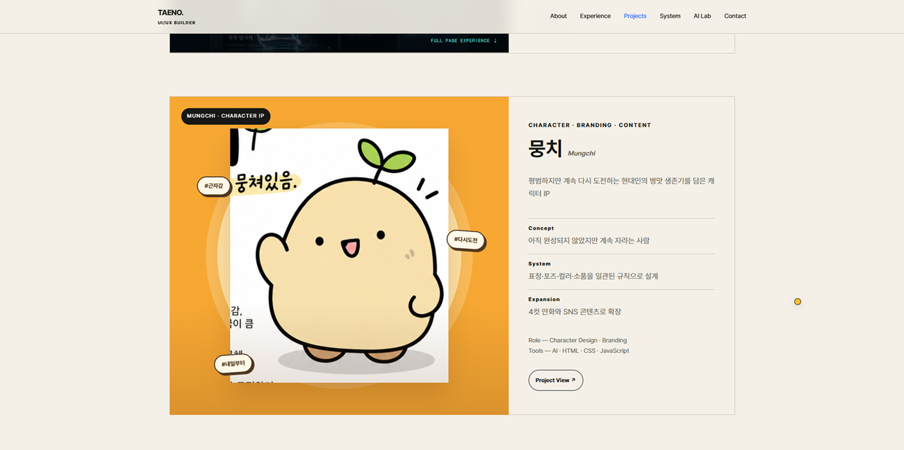
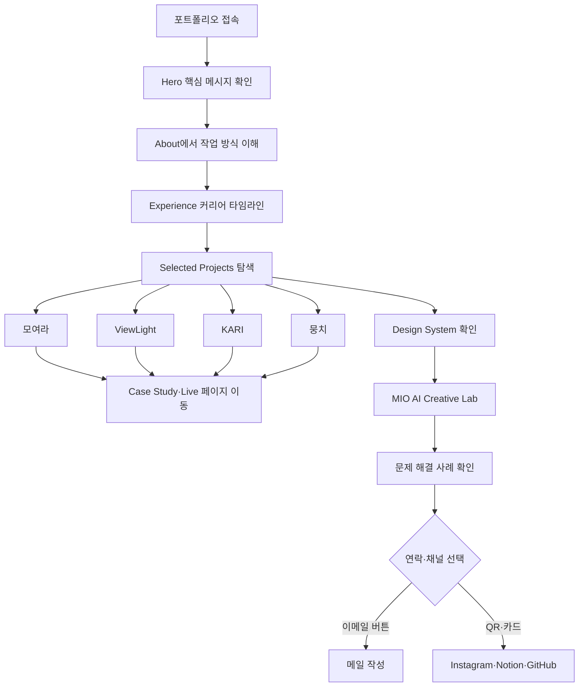
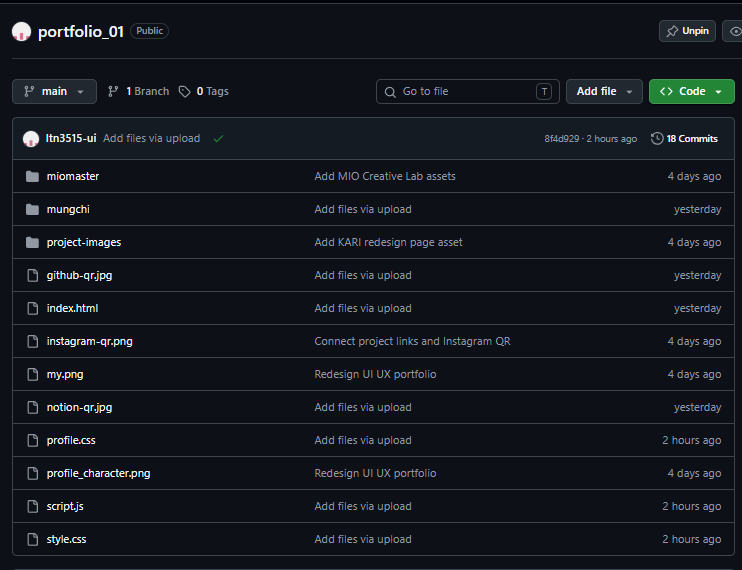

# 👋 TAENO Portfolio — UI/UX Designer & AI Vibe Coding Builder

> 13년 이상의 현장 경험을 사용자 중심의 디자인과 AI 바이브코딩으로 연결하고, 기획부터 구현·배포까지 직접 완성한 이태노의 인터랙티브 포트폴리오

<p>
  
  
  
  
  
  
  
  
</p>

## 🔗 프로젝트 링크

| 구분 | 링크 |
|---|---|
| ▲ Vercel 배포 | [portfolio-pink-nu-14.vercel.app](https://portfolio-pink-nu-14.vercel.app/) |
| 🌐 GitHub Pages | [ltn3515-ui.github.io/portfolio_01](https://ltn3515-ui.github.io/portfolio_01) |
| 📦 Deployments | [GitHub Deployments](https://github.com/ltn3515-ui/portfolio_01/deployments) |
| 💻 GitHub | [ltn3515-ui/portfolio_01](https://github.com/ltn3515-ui/portfolio_01) |
| 📝 Notion | [포트폴리오 기획 및 작업 기록](https://proud-syrup-039.notion.site/3d406f8b2220805cb394dd6977243451?source=copy_link) |

## 🖼️ 주요 화면

<table>
  <tr>
    <th>Hero · About</th>
    <th>Selected Projects</th>
    <th>Character IP · AI Creative</th>
  </tr>
  <tr>
    <td></td>
    <td></td>
    <td></td>
  </tr>
</table>

## 💡 프로젝트 개요

현장 실무 경력과 새롭게 습득한 UI/UX·프론트엔드·AI 역량이 서로 단절되어 보이지 않도록, 문제를 발견하고 디지털 서비스로 해결하는 하나의 이야기로 재구성한 개인 포트폴리오입니다.

모여라, ViewLight, KARI와 뭉치 프로젝트를 `Problem → Solution → Result` 구조로 소개하고, 디자인 시스템과 MIO AI 콘텐츠 제작 과정까지 함께 보여줍니다. 방문자는 결과물뿐 아니라 기획, 디자인, 구현과 배포로 이어지는 End-to-End 작업 방식을 확인할 수 있습니다.

### 핵심 목표

- 현장 경험을 사용자 문제 발견 역량으로 연결합니다.
- 프로젝트별 문제, 해결 방법과 결과를 빠르게 비교할 수 있게 합니다.
- UI/UX 디자인과 프론트엔드 구현 능력을 하나의 흐름으로 보여줍니다.
- AI를 기획·디자인·개발·콘텐츠 제작에 활용한 과정을 설명합니다.
- 데스크톱과 모바일에서 일관된 포트폴리오 경험을 제공합니다.

### 핵심 메시지

`현장의 경험 → 문제 발견 → 기획 → UI/UX → Development → Deploy`

## ✨ 주요 콘텐츠 & 인터랙션

### 1. Hero — 현장 경험에서 디지털 서비스로

“현장의 경험을, 디지털 서비스로 전환합니다.”라는 메시지를 중심으로 13년 이상의 실무 경험과 UI/UX·AI 바이브코딩 역량을 연결했습니다. MIO 캐릭터 비주얼과 플로팅 태그를 사용해 포트폴리오의 정체성을 전달합니다.

### 2. About & Experience — 커리어 전환 스토리

보안·시설관리, 인테리어·전문청소에서 디지털 분야로 이어지는 경험을 타임라인으로 구성했습니다. 현장에서 쌓은 관찰력, 책임감과 고객 이해를 디자인 문제 해결 역량으로 설명합니다.

### 3. Selected Projects — 결과물 중심 프로젝트 소개

| 프로젝트 | 문제 | 해결 방향 | 결과 |
|---|---|---|---|
| [모여라](moyora01-app.vercel.app) | 낯선 모임의 진입 장벽 | 친근한 시스템과 모바일 우선 UI | 배포 가능한 반응형 모임 경험 |
| [ViewLight](viewlight.vercel.app) | 조명 변화의 감각적 차이를 비교하기 어려움 | Before/After 조도 비교와 AI 큐레이션 | 직관적인 이커머스 웹 체험 |
| [KARI](https://ltn3515-ui.github.io/space_center) | 우주과학 전문 정보의 높은 이해 장벽 | Canvas·TTS·접근성 기반 인터랙션 | 몰입형 우주 학습 경험 |
| 뭉치 | 일상 공감 캐릭터의 확장 가능한 시스템 필요 | 표정·포즈·컬러·소품 규칙 설계 | 4컷 만화와 SNS 콘텐츠로 확장 |

각 카드에는 실제 화면, 담당 역할, 사용 기술과 Live Demo·Case Study·프로젝트 페이지 링크를 배치했습니다.

### 4. Design System & Process

와이어프레임, Pretendard 타이포그래피, 컬러 팔레트와 컴포넌트를 한눈에 볼 수 있도록 구성했습니다. 디자인 결과뿐 아니라 화면을 만드는 기준과 작업 프로세스를 함께 보여줍니다.

### 5. MIO AI Creative Lab

MIO 캐릭터 시트, 턴어라운드, 표정·포즈와 Master Pack을 통해 캐릭터 일관성 시스템을 소개합니다. `Character Design → Master Pack → Prompt System → Google Flow/Veo → Reels → Instagram`으로 이어지는 AI 콘텐츠 제작 파이프라인과 영상 결과물도 확인할 수 있습니다.

### 6. Problems I Solved

Vercel 권한 충돌, 대용량 이미지 프레임 로딩과 무거운 3D 자산 문제를 아코디언 형식으로 정리했습니다. 문제의 원인, 해결 과정과 개선 효과를 단계별로 보여줍니다.

### 7. 커스텀 마우스 커서

데스크톱 포인터 환경에서 노란 커스텀 커서, 링크 호버 확대, 클릭 리플과 프로젝트 카드의 `VIEW` 상태를 제공합니다. 터치 기기와 모션 감소 설정에서는 기본 사용성을 유지합니다.

### 8. Contact & QR 연결

연락 버튼을 선택하면 `ltn3515@gmail.com`을 받는 사람으로 하는 기본 메일 앱이 열립니다. 하단에는 Instagram·Notion·GitHub QR 카드를 배치해 콘텐츠, 작업 기록과 코드 저장소로 연결합니다.

## 🧭 사용자 플로우



## 🗂️ 폴더 구조

```text
portfolio_01/
├── miomaster/                       # MIO 캐릭터·영상 콘텐츠
│   ├── mio_charactersheet.png       # MIO 캐릭터 시트
│   ├── MIO_TURNAROUND.png           # 앞·옆·뒤 턴어라운드
│   ├── MIO_EXPRESSIONS_ACTIONS.png  # 표정과 액션 가이드
│   ├── MIO_FRONT.png                # 정면 기준 이미지
│   ├── MIO_SIDE_BACK.png            # 측면·후면 기준 이미지
│   ├── MIO_3QUARTER.png             # 3/4 방향 기준 이미지
│   ├── miomasterpack_01.png          # 캐릭터 마스터팩 01
│   ├── miomasterpack_02.png          # 캐릭터 마스터팩 02
│   ├── mio-transparent.png           # 투명 배경 캐릭터
│   ├── mio_wallpaper.png             # MIO 콘텐츠 월드
│   ├── mio-cover.png                 # 영상 커버 이미지
│   └── Mio_EP.02.mp4                 # MIO 에피소드 영상
├── mungchi/                         # 뭉치 캐릭터 소개 페이지
│   ├── css/                         # 뭉치 페이지 스타일
│   ├── images/                      # 캐릭터·콘텐츠 이미지
│   ├── js/                          # 뭉치 페이지 인터랙션
│   ├── index.html                   # 뭉치 상세 페이지
│   └── README.txt                   # 뭉치 페이지 안내
├── project-images/                  # 프로젝트 대표 화면
│   ├── moyora-home.png
│   ├── moyora-friends.png
│   ├── moyora-login.png
│   ├── viewlight-before-after.png
│   ├── viewlight-gallery.png
│   └── kari-redesign.png
├── index.html                       # 포트폴리오 전체 섹션·콘텐츠 구조
├── style.css                        # 메인 UI·프로젝트·반응형 스타일
├── profile.css                      # About·Experience·Contact·커서 확장 스타일
├── script.js                        # 메뉴·스크롤·아코디언·커서 인터랙션
├── profile_character.png            # Hero 캐릭터 이미지
├── my.png                           # 프로필 이미지
├── instagram-qr.png                 # Instagram QR
├── notion-qr.jpg                    # Notion QR
└── github-qr.jpg                    # GitHub QR
```

<details>
  <summary><strong>GitHub 저장소 구조 캡처 보기</strong></summary>
  <br />
  
</details>

## 🛠️ 기술 스택

| 구분 | 기술 | 활용 내용 |
|---|---|---|
| Markup | HTML5 | 시맨틱 섹션·프로젝트 카드·아코디언·연락 구조 |
| Styling | CSS3 | 반응형 그리드·프로젝트 목업·커서·캐릭터 연출 |
| Interaction | JavaScript | 모바일 메뉴·스크롤 상태·아코디언·커스텀 커서 |
| Motion | GSAP 3.12.5, ScrollTrigger | 스크롤 기반 섹션 등장과 인터랙션 |
| Accessibility | ARIA, Reduced Motion | 메뉴·아코디언 상태와 모션 감소 환경 대응 |
| Design | Figma, Design System | 와이어프레임·컴포넌트·프로젝트 UI 제작 |
| AI Content | Prompt Design, Google Flow, Veo | MIO 영상과 캐릭터 콘텐츠 제작 |
| Deploy | Vercel, GitHub Pages | 포트폴리오 정적 웹사이트 배포 |

## 🤖 AI 활용 프로세스

AI는 결과를 대신 만드는 도구가 아니라 기획과 코드의 초안을 빠르게 만들고, 사람이 실제 화면에서 검증·수정하는 협업 도구로 활용했습니다.

### ① 리서치·기획 — 경험과 역량 재구성

서로 다른 현장 경력을 단순 나열하지 않고 `현장에서 발견한 문제를 디지털 서비스로 해결하는 사람`이라는 정체성으로 연결하는 데 AI를 활용했습니다. 개인정보와 포트폴리오 목적에 불필요한 세부 정보는 직접 선별해 제외했습니다.

### ② 정보 구조 — 원페이지 사용자 여정

방문자가 정체성, 경력, 결과물, 작업 방식과 연락 정보를 순서대로 이해하도록 Hero부터 Contact까지의 정보 구조 초안을 AI와 함께 설계했습니다. 실제 프로젝트 중요도와 화면 길이에 맞춰 섹션 순서를 직접 조정했습니다.

### ③ UX/UI — 프로젝트별 시각 시스템

모여라는 따뜻한 노랑, ViewLight는 조명 중심의 어두운 톤, KARI는 우주·시안 컬러, 뭉치는 주황색 캐릭터 월드로 구분했습니다. AI로 레이아웃과 인터랙션 아이디어를 탐색한 뒤, 타이포그래피와 여백·컬러·반응형 규칙은 직접 통일했습니다.

### ④ 개발 — 바이브코딩과 인터랙션 구현

GSAP 스크롤 연출, 프로젝트 목업 애니메이션, 아코디언, 모바일 메뉴와 커스텀 커서 코드의 초안을 AI 바이브코딩으로 제작했습니다.

> “원페이지 포트폴리오에서 프로젝트 카드는 Problem·Solution·Result 구조로 보여주고, 데스크톱에서만 작동하는 커스텀 커서 인터랙션을 구현해줘.”

생성된 코드는 브라우저에서 직접 실행해 이벤트 중복, 모바일 레이아웃, 이미지 크롭과 접근성 상태를 검토하고 수정했습니다.

### ⑤ AI Character — MIO와 뭉치 제작

MIO의 외형을 일정하게 유지하기 위해 Character Sheet와 Master Pack, 프롬프트 규칙을 구성했습니다. Google Flow·Veo를 이용한 영상 생성 과정에서 장면별 프롬프트를 설계하고 결과를 반복 수정했습니다. 뭉치는 캐릭터 콘셉트, 표정·포즈와 4컷 만화 아이디어를 만드는 데 AI를 활용했습니다.

### ⑥ 콘텐츠 — 카피와 프로젝트 설명

프로젝트별 문제, 해결 방향과 결과를 짧고 일관된 문장으로 정리하고, 발표·SNS·포트폴리오에 맞게 문장의 길이와 톤을 조정하는 데 AI를 사용했습니다.

### ⑦ 테스트·배포 — 오류 분석과 개선

Vercel 권한, GitHub Pages 경로, 고해상도 이미지 로딩과 반응형 오류의 원인을 분석하는 데 AI를 활용했습니다. 제안된 해결 방법은 실제 코드와 배포 화면에서 확인한 뒤 반영했습니다.

## 🩹 트러블슈팅

| 이슈 | 원인 | 해결 |
|---|---|---|
| Vercel 저장소 연결과 배포 실패 | Organization 권한과 앱 접근 범위 불일치 | 저장소 권한·환경 설정과 배포 연결 재구성 |
| 대용량 프레임 콘텐츠 초기 지연 | 고해상도 이미지가 동시에 로드됨 | 비동기 프리로드와 렌더링 순서 최적화 |
| 일부 프로젝트 이미지 상단 잘림 | 데스크톱 고정 높이와 `object-fit: cover` | 원본 비율을 유지하도록 높이와 object-fit 규칙 수정 |
| 모바일 메뉴와 카드 레이아웃 충돌 | 데스크톱 그리드가 작은 화면까지 유지됨 | 900px·520px 반응형 분기와 1열 재배치 적용 |
| 이메일 버튼이 주소 복사로만 동작 | 버튼 이벤트와 연락 방식 불일치 | `mailto:` 링크로 변경해 메일 앱과 제목 자동 연결 |
| 커스텀 커서가 터치 환경을 방해함 | 포인터 환경 구분 없이 커서 적용 | hover·fine pointer 조건에서만 커스텀 커서 활성화 |

## 🚀 로컬 실행 방법

HTML·CSS·JavaScript로 제작한 정적 포트폴리오이므로 별도의 패키지 설치 없이 실행할 수 있습니다. 영상과 하위 프로젝트 경로를 안정적으로 불러오려면 로컬 서버를 권장합니다.

```bash
# 저장소 복제
git clone https://github.com/ltn3515-ui/portfolio_01.git

# 프로젝트 폴더 이동
cd portfolio_01

# VS Code Live Server 또는 간단한 로컬 서버 실행
python -m http.server 5500
```

브라우저에서 `http://localhost:5500`으로 접속합니다.

## 📌 향후 개선 계획

- 프로젝트별 상세 Case Study 링크와 과정 페이지 확장
- Notion QR 카드의 클릭 링크 연결 및 접근성 보완
- MIO·뭉치 콘텐츠 에피소드와 제작 과정 업데이트
- 이미지 WebP·AVIF 변환과 영상 지연 로딩
- 프로젝트 유입·CTA 클릭 분석 도구 연동
- 다국어 소개와 영문 포트폴리오 버전 제작

## 👤 담당 업무

- 개인 브랜딩과 포트폴리오 정보 구조 기획
- 사용자 플로우·와이어프레임·UI 디자인
- 모여라·ViewLight·KARI·뭉치 프로젝트 제작 및 정리
- HTML·CSS·JavaScript 반응형 퍼블리싱
- GSAP·스크롤·커스텀 커서 인터랙션 구현
- MIO 캐릭터 시스템과 AI 영상 콘텐츠 제작
- AI 바이브코딩을 활용한 코드 생성·검증·트러블슈팅
- GitHub 형상관리와 Vercel·GitHub Pages 배포

## 📄 라이선스

본 프로젝트는 이태노의 개인 포트폴리오 및 학습 결과를 소개하기 위해 제작되었습니다. 포함된 프로젝트 이미지와 캐릭터 콘텐츠의 무단 사용을 금합니다.
